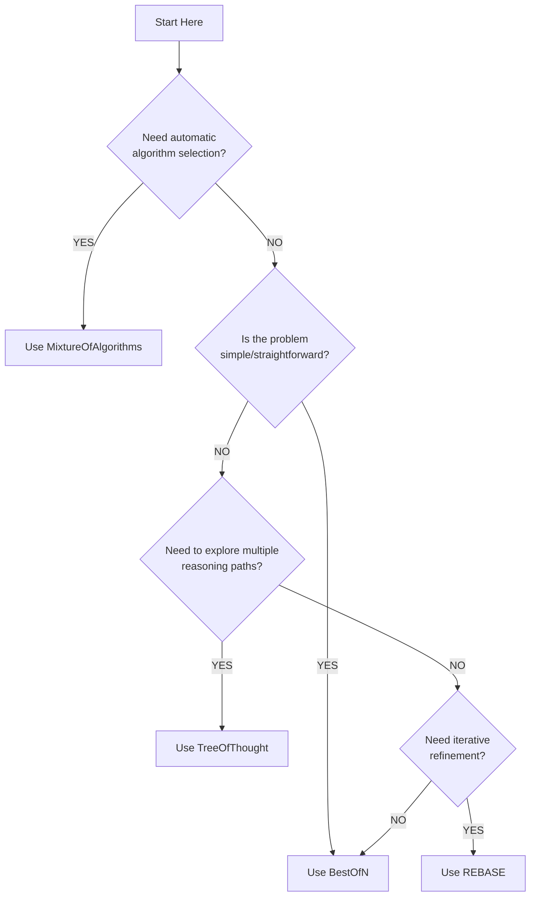

# Algorithm Selection Guide

This guide helps you choose the right planning algorithm for your problem. PlanGEN offers four main algorithms, each with different strengths and use cases.

## Quick Reference

| Algorithm | Best For | Speed | Quality | Complexity |
|-----------|----------|-------|---------|------------|
| **BestOfN** | Simple problems, quick results | Fast | Good | Low |
| **TreeOfThought** | Complex reasoning, exploration | Medium | Excellent | Medium |
| **REBASE** | Iterative refinement | Slow | Excellent | High |
| **Mixture** | Automatic selection | Varies | Excellent | Low (auto) |

## Decision Tree



## Algorithm Comparison

### BestOfN

**How it works:**

1. Generate N independent solutions
2. Evaluate each solution
3. Select the best one

**Strengths:**

- Simple and fast
- Highly parallelizable
- Good for diverse solution space
- Low complexity

**Weaknesses:**

- No interaction between solutions
- No refinement
- May require many samples for complex problems

**Best for:**

- Simple to moderate problems
- When speed is important
- When you want diverse solutions
- Prototyping and testing

**Example:**

```python
result = plangen.solve(
    problem,
    algorithm="best_of_n",
    n_plans=5,
    parallel=True
)
```

### TreeOfThought

**How it works:**

1. Start with initial reasoning
2. Branch into multiple paths
3. Evaluate and prune branches
4. Explore promising paths deeper
5. Select best final solution

**Strengths:**

- Explores multiple reasoning paths
- Can backtrack from dead ends
- Good for complex problems
- Structured exploration

**Weaknesses:**

- Slower than BestOfN
- More API calls
- Can be overkill for simple problems

**Best for:**

- Complex reasoning tasks
- Problems with multiple approaches
- When exploration is valuable
- Multi-step problems

**Example:**

```python
result = plangen.solve(
    problem,
    algorithm="tree_of_thought",
    branching_factor=3,
    max_depth=5,
    beam_width=2
)
```

### REBASE

**How it works:**

1. Generate initial solution
2. Verify and get feedback
3. Refine based on feedback
4. Repeat until convergence or max iterations

**Strengths:**

- Iterative improvement
- Learns from mistakes
- Can achieve high quality
- Good for optimization

**Weaknesses:**

- Slowest algorithm
- Most API calls
- May get stuck in local optima

**Best for:**

- Problems needing refinement
- When quality is critical
- Optimization problems
- When initial solutions are incomplete

**Example:**

```python
result = plangen.solve(
    problem,
    algorithm="rebase",
    max_iterations=10,
    improvement_threshold=0.1
)
```

### MixtureOfAlgorithms

**How it works:**

1. Analyze problem characteristics
2. Select appropriate algorithm
3. Can switch algorithms mid-execution
4. Returns best result

**Strengths:**

- Automatic selection
- Adapts to problem
- Often best performance
- No tuning needed

**Weaknesses:**

- Less control
- Harder to debug
- Overhead of selection

**Best for:**

- Unknown problem types
- Production systems
- When you want "best" automatically
- Diverse problem sets

**Example:**

```python
result = plangen.solve(
    problem,
    algorithm="mixture"
)
```

## Use Case Examples

### Calendar Scheduling

**Recommended: BestOfN**

Scheduling is usually straightforward with clear constraints. Multiple diverse solutions help explore different time slots.

```python
result = plangen.solve(
    "Schedule a 30-min meeting for 3 people...",
    algorithm="best_of_n",
    n_plans=5
)
```

### Algorithm Design

**Recommended: TreeOfThought**

Algorithm design benefits from exploring different approaches and backtracking from inefficient solutions.

```python
result = plangen.solve(
    "Design an algorithm to find the kth largest element...",
    algorithm="tree_of_thought",
    branching_factor=3,
    max_depth=4
)
```

### Mathematical Proofs

**Recommended: REBASE**

Proofs often need refinement to fix errors and improve clarity through iteration.

```python
result = plangen.solve(
    "Prove that the sum of first n natural numbers is n(n+1)/2",
    algorithm="rebase",
    max_iterations=5
)
```

### Creative Writing

**Recommended: TreeOfThought or BestOfN**

Creative tasks benefit from exploration (TreeOfThought) or diverse options (BestOfN).

```python
# Exploration-focused
result = plangen.solve(
    "Write a short story about...",
    algorithm="tree_of_thought"
)

# Diversity-focused
result = plangen.solve(
    "Write a short story about...",
    algorithm="best_of_n",
    n_plans=10,
    sampling_strategy="diverse"
)
```

### Code Generation

**Recommended: REBASE**

Code often needs debugging and refinement based on test failures.

```python
result = plangen.solve(
    "Write a function to sort a list...",
    algorithm="rebase",
    max_iterations=5
)
```

### Planning Tasks

**Recommended: TreeOfThought**

Planning benefits from considering multiple paths and contingencies.

```python
result = plangen.solve(
    "Plan a 7-day trip to Japan...",
    algorithm="tree_of_thought",
    branching_factor=4
)
```

## Performance Considerations

### API Calls

Approximate API calls per problem:

- **BestOfN**: `2 * n_plans` (generation + verification)
- **TreeOfThought**: `branching_factor * max_depth * 2`
- **REBASE**: `2 * max_iterations`
- **Mixture**: Varies (typically like BestOfN)

### Time Complexity

From fastest to slowest:

1. BestOfN (especially with parallel=True)
2. Mixture
3. TreeOfThought
4. REBASE

### Cost Considerations

Consider both API costs and latency:

```python
# Most cost-effective for simple problems
result = plangen.solve(problem, algorithm="best_of_n", n_plans=3)

# Medium cost, good quality
result = plangen.solve(problem, algorithm="mixture")

# Higher cost but best quality
result = plangen.solve(problem, algorithm="rebase", max_iterations=10)
```

## Tuning Parameters

### BestOfN Parameters

```python
# Quick and cheap
n_plans=3, parallel=True

# Balanced
n_plans=5, sampling_strategy="diverse", parallel=True

# High quality
n_plans=10, sampling_strategy="adaptive", parallel=True
```

### TreeOfThought Parameters

```python
# Quick exploration
branching_factor=2, max_depth=3, beam_width=1

# Balanced
branching_factor=3, max_depth=5, beam_width=2

# Deep exploration
branching_factor=4, max_depth=7, beam_width=3
```

### REBASE Parameters

```python
# Quick refinement
max_iterations=3, improvement_threshold=0.2

# Balanced
max_iterations=5, improvement_threshold=0.1

# Thorough refinement
max_iterations=10, improvement_threshold=0.05
```

## Combining Algorithms

You can use different algorithms for different stages:

```python
# Generate diverse initial solutions with BestOfN
from plangen.algorithms import BestOfN
best_of_n = BestOfN(n_plans=5, llm_interface=model)
initial_plans, scores, _ = best_of_n.run(problem)

# Refine best plan with REBASE
from plangen.algorithms import REBASE
rebase = REBASE(max_iterations=5, llm_interface=model)
refined_plan, final_score, _ = rebase.run(
    problem,
    initial_solution=initial_plans[0]
)
```

## Debugging and Visualization

Enable visualization to understand algorithm behavior:

```python
from plangen.visualization import GraphRenderer
from plangen.algorithms import TreeOfThought

# Create visualizer
renderer = GraphRenderer(output_dir="./viz")

# Create algorithm and add visualizer
tot = TreeOfThought(branching_factor=3, max_depth=5, llm_interface=model)
tot.add_observer(renderer)

# Run and visualize
result, score, metadata = tot.run(problem)
# Check ./viz directory for visualizations
```

## Recommendations by Problem Type

| Problem Type | Primary Choice | Alternative | Why |
|--------------|---------------|-------------|-----|
| Scheduling | BestOfN | Mixture | Fast, multiple options |
| Algorithm Design | TreeOfThought | REBASE | Need exploration |
| Math Problems | REBASE | TreeOfThought | Need refinement |
| Code Generation | REBASE | TreeOfThought | Iterative debugging |
| Creative Tasks | TreeOfThought | BestOfN | Multiple approaches |
| Optimization | REBASE | TreeOfThought | Iterative improvement |
| Planning | TreeOfThought | BestOfN | Consider alternatives |
| Q&A | BestOfN | Mixture | Quick answers |
| Unknown | Mixture | BestOfN | Auto-selection |

## Starting Point

If you're unsure, start with these defaults:

```python
# For most problems
result = plangen.solve(problem, algorithm="mixture")

# If mixture is too slow
result = plangen.solve(problem, algorithm="best_of_n", n_plans=5)

# If quality is critical and time allows
result = plangen.solve(problem, algorithm="rebase", max_iterations=5)
```

## Next Steps

- Read detailed algorithm references: [BestOfN](best_of_n.md), [TreeOfThought](tree_of_thought.md), [REBASE](rebase.md), [Mixture](mixture_of_algorithms.md)
- See [Examples](../examples/index.md) for practical use cases
- Check [Visualization](../user_guide/visualization.md) for debugging tools
