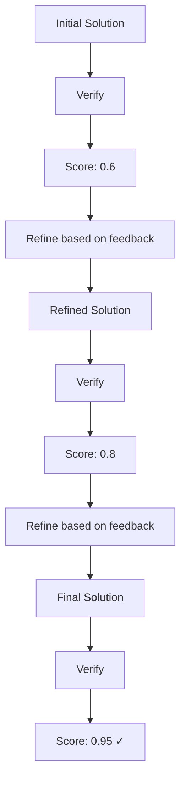

# REBASE

REBASE (Recursive Refinement Based on Assessment and Selection Enhancement) is an iterative algorithm that generates an initial solution and continuously refines it based on verification feedback until convergence or maximum iterations.

## Overview

REBASE follows an iterative improvement loop:

1. Generate initial solution
2. Verify and get feedback
3. Refine based on feedback
4. Repeat until improvement threshold or max iterations

## How It Works



## When to Use

REBASE is ideal for:

- **Problems requiring refinement** through iteration
- **Optimization tasks** where incremental improvement is valuable
- **Complex solutions** that are unlikely to be perfect initially
- **Quality-critical applications** where time allows for refinement

Avoid for:

- Simple problems solvable in one pass
- Time-sensitive applications
- Problems with binary correctness (either right or wrong)

## Parameters

### Core Parameters

| Parameter | Type | Default | Description |
|-----------|------|---------|-------------|
| `max_iterations` | int | 5 | Maximum refinement iterations |
| `improvement_threshold` | float | 0.1 | Minimum score improvement to continue |
| `llm_interface` | ModelProtocol | Required | Language model interface |

### Advanced Parameters

| Parameter | Type | Default | Description |
|-----------|------|---------|-------------|
| `min_score` | float | 0.8 | Target minimum score |
| `patience` | int | 2 | Iterations without improvement before stopping |
| `feedback_format` | str | "detailed" | Level of feedback detail |

## Usage Examples

### Basic Usage

```python
from plangen import PlanGen

plangen = PlanGen.create()

result = plangen.solve(
    problem="Write a Python function to implement binary search",
    algorithm="rebase",
    max_iterations=5,
    improvement_threshold=0.1
)

print(result["selected_solution"])
```

### With Algorithm Class

```python
from plangen.algorithms import REBASE
from plangen.models import OpenAIModelInterface

# Create model
model = OpenAIModelInterface(model_name="gpt-4o")

# Create algorithm
rebase = REBASE(
    max_iterations=10,
    improvement_threshold=0.05,
    llm_interface=model
)

# Run algorithm
problem = "Prove that the sum of first n natural numbers is n(n+1)/2"
best_plan, score, metadata = rebase.run(problem)

print(f"Final solution (score: {score}):\n{best_plan}")
print(f"\nIterations: {metadata['iterations']}")
print(f"Score history: {metadata['score_history']}")
```

### With Custom Initial Solution

```python
from plangen.algorithms import REBASE

# Create algorithm
rebase = REBASE(
    max_iterations=5,
    improvement_threshold=0.1,
    llm_interface=model
)

# Provide initial solution
initial_solution = """
def binary_search(arr, target):
    left, right = 0, len(arr)
    while left < right:
        mid = (left + right) // 2
        if arr[mid] == target:
            return mid
    return -1
"""

problem = "Write a correct binary search implementation"
refined_solution, score, metadata = rebase.run(
    problem,
    initial_solution=initial_solution
)
```

### With Visualization

```python
from plangen.algorithms import REBASE
from plangen.visualization import GraphRenderer

# Create visualizer
renderer = GraphRenderer(output_dir="./rebase_visualizations")

# Create algorithm
rebase = REBASE(
    max_iterations=10,
    improvement_threshold=0.05,
    llm_interface=model
)

# Add observer
rebase.add_observer(renderer)

# Run algorithm
problem = "Design a cache eviction policy"
solution, score, metadata = rebase.run(problem)

# Check ./rebase_visualizations for:
# - iteration_scores.png (score progression)
# - feedback_summary.txt (feedback at each iteration)
```

## Configuration Strategies

### Quick Refinement

Good for: Simple improvements, time-sensitive tasks

```python
rebase = REBASE(
    max_iterations=3,
    improvement_threshold=0.2,  # Stop after small improvement
    llm_interface=model
)
```

### Thorough Refinement

Good for: Quality-critical tasks, complex problems

```python
rebase = REBASE(
    max_iterations=10,
    improvement_threshold=0.05,  # Continue for small improvements
    min_score=0.95,              # High quality target
    llm_interface=model
)
```

### Balanced Refinement

Good for: Most general problems

```python
rebase = REBASE(
    max_iterations=5,
    improvement_threshold=0.1,
    llm_interface=model
)
```

## Use Case Examples

### Code Generation with Bug Fixes

```python
problem = """
Write a Python function to validate email addresses.
Handle edge cases like:
- Multiple @ symbols
- Missing domain
- Invalid characters
- Empty strings
"""

rebase = REBASE(
    max_iterations=7,
    improvement_threshold=0.08,
    llm_interface=model
)

code, score, metadata = rebase.run(problem)
print(f"Generated after {metadata['iterations']} iterations")
```

### Mathematical Proof Refinement

```python
problem = """
Prove by induction that 1 + 2 + 3 + ... + n = n(n+1)/2
Include:
- Base case
- Inductive hypothesis
- Inductive step
- Conclusion
"""

rebase = REBASE(
    max_iterations=5,
    improvement_threshold=0.1,
    llm_interface=model
)

proof, score, metadata = rebase.run(problem)
```

### Essay Writing and Editing

```python
problem = """
Write a 500-word essay on the impact of AI on education.
Include:
- Clear thesis statement
- Supporting arguments
- Examples
- Conclusion
"""

rebase = REBASE(
    max_iterations=6,
    improvement_threshold=0.1,
    llm_interface=model
)

essay, score, metadata = rebase.run(problem)
```

## Understanding the Output

### Metadata Structure

```python
metadata = {
    'algorithm': 'rebase',
    'iterations': 5,
    'initial_score': 0.60,
    'final_score': 0.92,
    'score_history': [0.60, 0.72, 0.85, 0.90, 0.92],
    'feedback_history': [
        'Missing edge case handling',
        'Improved but efficiency could be better',
        'Good solution, minor style issues',
        'Nearly perfect, small documentation gap',
        'Excellent solution'
    ],
    'improvements': [
        {'iteration': 1, 'delta': 0.12},
        {'iteration': 2, 'delta': 0.13},
        {'iteration': 3, 'delta': 0.05},
        {'iteration': 4, 'delta': 0.02}  # Below threshold, stopped
    ],
    'generation_time': 35.2,
    'verification_time': 28.5,
    'total_time': 63.7,
    'stop_reason': 'improvement_threshold'
}
```

### Stop Reasons

- `improvement_threshold`: Improvement below threshold
- `max_iterations`: Reached maximum iterations
- `min_score_reached`: Achieved target score
- `no_improvement`: No improvement for `patience` iterations

## Performance Characteristics

### Time Complexity

`O(k)` where `k` = number of iterations

### API Calls

Approximately: `2 * iterations` calls

- One for refinement generation
- One for verification

### Actual Cost Example

```python
# Configuration
max_iterations = 5

# Best case (converges early)
iterations = 3
total_calls = 3 * 2 = 6

# Worst case (all iterations)
iterations = 5
total_calls = 5 * 2 = 10
```

## Comparison with Other Algorithms

| Aspect | REBASE | BestOfN | TreeOfThought |
|--------|--------|---------|---------------|
| Approach | Iterative | Parallel | Tree search |
| Refinement | Yes | No | Minimal |
| Convergence | Yes | N/A | N/A |
| Best for | Optimization | Speed | Exploration |
| Speed | Slow | Fast | Medium |
| Quality | Excellent | Good | Excellent |

## Iteration Patterns

### Typical Iteration Pattern

```python
Iteration 1: Score 0.60 → Fix critical issues
Iteration 2: Score 0.75 → Address major problems  
Iteration 3: Score 0.85 → Improve edge cases
Iteration 4: Score 0.90 → Polish and optimize
Iteration 5: Score 0.92 → Final refinements
```

### Convergence Pattern

```mermaid
xychart-beta
    title "REBASE Score Convergence"
    x-axis "Iteration" [1, 2, 3, 4, 5]
    y-axis "Score" 0 --> 1
    line [0.45, 0.65, 0.80, 0.90, 0.92]
```

## Advanced Features

### Custom Refinement Prompts

```python
class CustomREBASE(REBASE):
    def generate_refinement_prompt(self, problem, current_solution, feedback):
        """Custom refinement prompt."""
        return f"""
        Problem: {problem}
        
        Current Solution:
        {current_solution}
        
        Issues Found:
        {feedback}
        
        Your task:
        1. Address each issue mentioned
        2. Maintain correct parts of the solution
        3. Improve overall quality
        4. Add comments explaining changes
        
        Provide the refined solution:
        """
```

### Adaptive Threshold

```python
class AdaptiveREBASE(REBASE):
    def should_continue(self, iteration, current_score, previous_score):
        """Adaptive stopping condition."""
        improvement = current_score - previous_score
        
        # Dynamic threshold based on iteration
        threshold = self.improvement_threshold * (1 - iteration / self.max_iterations)
        
        return improvement >= threshold and iteration < self.max_iterations
```

## Best Practices

### 1. Set Appropriate Max Iterations

```python
# Simple problems
max_iterations = 3

# Moderate problems
max_iterations = 5

# Complex problems
max_iterations = 10
```

### 2. Use Reasonable Thresholds

```python
# Strict (stop early)
improvement_threshold = 0.2

# Balanced
improvement_threshold = 0.1

# Lenient (refine thoroughly)
improvement_threshold = 0.05
```

### 3. Provide Good Initial Solutions

```python
# Generate better initial solution
initial = plangen.generate_plan(problem, constraints)

# Refine it with REBASE
rebase = REBASE(max_iterations=5, llm_interface=model)
refined, score, metadata = rebase.run(problem, initial_solution=initial)
```

### 4. Monitor Convergence

```python
result, score, metadata = rebase.run(problem)

# Check if converged properly
if metadata['stop_reason'] == 'improvement_threshold':
    print("Converged successfully")
elif metadata['stop_reason'] == 'max_iterations':
    print("May need more iterations")

# Analyze score progression
import matplotlib.pyplot as plt
plt.plot(metadata['score_history'])
plt.xlabel('Iteration')
plt.ylabel('Score')
plt.title('REBASE Convergence')
plt.show()
```

## Troubleshooting

### Not Converging

- Increase `max_iterations`
- Decrease `improvement_threshold`
- Check if problem is suitable for iterative refinement

```python
# More lenient configuration
rebase = REBASE(
    max_iterations=15,
    improvement_threshold=0.03,
    llm_interface=model
)
```

### Slow Performance

- Reduce `max_iterations`
- Increase `improvement_threshold`
- Use faster model

```python
# Faster configuration
rebase = REBASE(
    max_iterations=3,
    improvement_threshold=0.2,
    llm_interface=faster_model
)
```

### Score Oscillating

- Add patience parameter
- Use verification smoothing
- Check verification consistency

```python
rebase = REBASE(
    max_iterations=10,
    improvement_threshold=0.1,
    patience=3,  # Stop after 3 iterations without improvement
    llm_interface=model
)
```

## Combining with Other Algorithms

### REBASE after BestOfN

```python
# Generate diverse initial solutions
best_of_n = BestOfN(n_plans=5, llm_interface=model)
initial_plan, _, _ = best_of_n.run(problem)

# Refine the best one
rebase = REBASE(max_iterations=5, llm_interface=model)
refined_plan, score, _ = rebase.run(problem, initial_solution=initial_plan)
```

### REBASE with TreeOfThought Initial

```python
# Explore with TreeOfThought
tot = TreeOfThought(branching_factor=3, max_depth=4, llm_interface=model)
explored_plan, _, _ = tot.run(problem)

# Refine with REBASE
rebase = REBASE(max_iterations=5, llm_interface=model)
final_plan, score, _ = rebase.run(problem, initial_solution=explored_plan)
```

## Next Steps

- See [Algorithm Selection Guide](algorithm_selection_guide.md) for choosing algorithms
- Read [BestOfN](best_of_n.md) for simpler alternative
- Check [TreeOfThought](tree_of_thought.md) for exploration-focused approach
- Explore [Visualization](../user_guide/visualization.md) to track refinement progress
