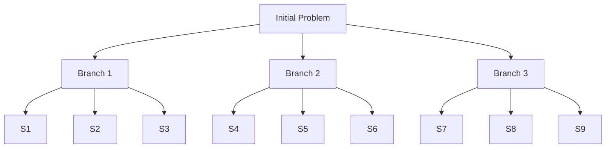

# TreeOfThought

The TreeOfThought algorithm explores multiple reasoning paths in a tree structure, allowing for branching, evaluation, and backtracking to find the best solution.

## Overview

TreeOfThought builds a search tree where:

1. Each node represents a reasoning step or partial solution
2. Multiple branches explore different approaches
3. Nodes are evaluated and pruned based on promise
4. The best path leads to the final solution

## How It Works



**Process:**

1. **Generate Branches**: Create multiple reasoning paths from current node
2. **Evaluate**: Score each branch based on promise/validity
3. **Prune**: Keep only top branches (beam search)
4. **Expand**: Continue from promising branches
5. **Repeat**: Until max depth or solution found

## When to Use

TreeOfThought excels at:

- **Complex reasoning tasks** requiring multiple steps
- **Problems with multiple valid approaches** to explore
- **Multi-step planning** where early decisions affect later ones
- **Tasks benefiting from backtracking** when approaches fail

Avoid for:

- Simple, straightforward problems
- When speed is critical
- Problems with clear single solution path

## Parameters

### Core Parameters

| Parameter | Type | Default | Description |
|-----------|------|---------|-------------|
| `branching_factor` | int | 3 | Number of branches from each node |
| `max_depth` | int | 5 | Maximum tree depth |
| `beam_width` | int | 2 | Number of best branches to keep at each level |
| `llm_interface` | ModelProtocol | Required | Language model interface |

### Advanced Parameters

| Parameter | Type | Default | Description |
|-----------|------|---------|-------------|
| `evaluation_strategy` | str | "llm" | How to evaluate nodes ("llm" or "heuristic") |
| `pruning_threshold` | float | 0.3 | Minimum score to keep a branch |
| `domain_template` | str | None | Domain-specific reasoning template |

## Usage Examples

### Basic Usage

```python
from plangen import PlanGen

plangen = PlanGen.create()

result = plangen.solve(
    problem="Design an algorithm to find the kth largest element in an array",
    algorithm="tree_of_thought",
    branching_factor=3,
    max_depth=5,
    beam_width=2
)

print(result["selected_solution"])
```

### With Algorithm Class

```python
from plangen.algorithms import TreeOfThought
from plangen.models import OpenAIModelInterface

# Create model
model = OpenAIModelInterface(model_name="gpt-4o")

# Create algorithm
tot = TreeOfThought(
    branching_factor=4,
    max_depth=6,
    beam_width=3,
    llm_interface=model
)

# Run algorithm
problem = "Plan a 7-day trip to Japan with a budget of $3000"
best_plan, score, metadata = tot.run(problem)

print(f"Best plan (score: {score}):\n{best_plan}")
print(f"\nMetadata: {metadata}")
```

### With Visualization

```python
from plangen.algorithms import TreeOfThought
from plangen.visualization import GraphRenderer
from plangen.models import OpenAIModelInterface

# Create model
model = OpenAIModelInterface(model_name="gpt-4o")

# Create visualizer
renderer = GraphRenderer(output_dir="./tree_visualizations")

# Create algorithm
tot = TreeOfThought(
    branching_factor=3,
    max_depth=5,
    beam_width=2,
    llm_interface=model
)

# Add observer for visualization
tot.add_observer(renderer)

# Run algorithm
problem = "Design a system for managing a library"
best_plan, score, metadata = tot.run(problem)

# Check ./tree_visualizations for generated graphs
```

## Configuration Strategies

### Shallow, Wide Exploration

Good for: Exploring many alternatives quickly

```python
tot = TreeOfThought(
    branching_factor=5,  # Many branches
    max_depth=3,         # Shallow depth
    beam_width=3,        # Keep more alternatives
    llm_interface=model
)
```

### Deep, Narrow Exploration

Good for: Following promising paths deeply

```python
tot = TreeOfThought(
    branching_factor=2,  # Fewer branches
    max_depth=8,         # Deep exploration
    beam_width=1,        # Focus on best path
    llm_interface=model
)
```

### Balanced Exploration

Good for: Most general problems

```python
tot = TreeOfThought(
    branching_factor=3,
    max_depth=5,
    beam_width=2,
    llm_interface=model
)
```

## Use Case Examples

### Algorithm Design

```python
problem = """
Design an efficient algorithm to find the longest palindromic substring.
Consider time and space complexity trade-offs.
"""

tot = TreeOfThought(
    branching_factor=3,  # Try different approaches
    max_depth=5,         # Detailed reasoning
    beam_width=2,        # Keep best approaches
    llm_interface=model
)

solution, score, metadata = tot.run(problem)
```

### Planning Task

```python
problem = """
Plan a 3-day hackathon event for 100 participants.
Include schedule, venue setup, and contingency plans.
"""

tot = TreeOfThought(
    branching_factor=4,  # Many planning options
    max_depth=6,         # Detailed planning
    beam_width=2,        # Keep good alternatives
    llm_interface=model
)

plan, score, metadata = tot.run(problem)
```

### Creative Writing

```python
problem = """
Write a short science fiction story about AI and humanity.
Include plot development, character arcs, and themes.
"""

tot = TreeOfThought(
    branching_factor=5,  # Explore plot directions
    max_depth=4,         # Story structure
    beam_width=3,        # Keep creative options
    llm_interface=model
)

story, score, metadata = tot.run(problem)
```

## Understanding the Output

### Metadata Structure

```python
metadata = {
    'algorithm': 'tree_of_thought',
    'total_nodes': 45,
    'total_branches': 135,
    'explored_depth': 5,
    'pruned_branches': 90,
    'best_path': [
        {'depth': 0, 'node_id': 'root', 'score': 0.0},
        {'depth': 1, 'node_id': 'n1_2', 'score': 0.85},
        {'depth': 2, 'node_id': 'n2_5', 'score': 0.90},
        {'depth': 3, 'node_id': 'n3_8', 'score': 0.95},
        {'depth': 4, 'node_id': 'n4_12', 'score': 0.92},
        {'depth': 5, 'node_id': 'n5_15', 'score': 0.88}
    ],
    'generation_time': 45.3,
    'evaluation_time': 32.1,
    'total_time': 77.4
}
```

### Visualization Output

When using a GraphRenderer observer, TreeOfThought generates:

- **tree_structure.png**: Visual representation of the search tree
- **path_scores.png**: Score evolution along explored paths
- **pruning_summary.txt**: Details on pruned branches

## Performance Characteristics

### Time Complexity

`O(b^d * k)` where:

- `b` = branching_factor
- `d` = max_depth
- `k` = beam_width

### API Calls

Approximately: `branching_factor * max_depth * 2` calls

- One for generation
- One for evaluation

### Actual Cost Example

```python
# Configuration
branching_factor = 3
max_depth = 5
beam_width = 2

# Estimated API calls
generation_calls = 3 * 5 = 15
evaluation_calls = 3 * 5 = 15
total_calls ≈ 30

# With pruning, actual calls are typically lower
```

## Comparison with Other Algorithms

| Aspect | TreeOfThought | BestOfN | REBASE |
|--------|---------------|---------|---------|
| Exploration | Structured | Independent | Sequential |
| Backtracking | Yes | No | No |
| Refinement | Minimal | No | Yes |
| Best for | Complex reasoning | Quick results | Optimization |
| Speed | Medium | Fast | Slow |
| API calls | High | Medium | Medium-High |

## Advanced Features

### Custom Evaluation

```python
class CustomTreeOfThought(TreeOfThought):
    def evaluate_node(self, node, problem, constraints):
        """Custom node evaluation logic."""
        # Use domain-specific heuristics
        base_score = super().evaluate_node(node, problem, constraints)
        
        # Apply custom scoring
        if self._meets_custom_criteria(node):
            base_score *= 1.2
        
        return min(1.0, base_score)
    
    def _meets_custom_criteria(self, node):
        # Your custom logic
        return True
```

### Domain Templates

```python
# Algorithm design template
algorithm_template = """
At each step, consider:
1. Data structures needed
2. Time complexity implications
3. Space complexity trade-offs
4. Edge cases to handle

Current reasoning: {current_node}
Next step: {branch}
"""

tot = TreeOfThought(
    branching_factor=3,
    max_depth=5,
    llm_interface=model,
    domain_template=algorithm_template
)
```

## Best Practices

### 1. Start with Balanced Parameters

```python
# Good starting point
tot = TreeOfThought(
    branching_factor=3,
    max_depth=5,
    beam_width=2,
    llm_interface=model
)
```

### 2. Use Visualization for Debugging

```python
renderer = GraphRenderer(output_dir="./debug_viz")
tot.add_observer(renderer)
# Run and examine visualizations
```

### 3. Adjust Based on Problem

```python
# For exploration-heavy problems
branching_factor = 4  # More options
beam_width = 3        # Keep more paths

# For depth-first problems  
branching_factor = 2  # Fewer options
max_depth = 8         # Deeper exploration
```

### 4. Monitor Performance

```python
import time

start = time.time()
solution, score, metadata = tot.run(problem)
duration = time.time() - start

print(f"Solved in {duration:.1f}s")
print(f"API calls: ~{metadata['total_nodes'] * 2}")
print(f"Explored: {metadata['total_nodes']} nodes")
```

## Troubleshooting

### Too Slow

- Reduce `branching_factor`
- Reduce `max_depth`
- Reduce `beam_width`

```python
# Faster configuration
tot = TreeOfThought(
    branching_factor=2,
    max_depth=3,
    beam_width=1,
    llm_interface=model
)
```

### Poor Quality

- Increase `branching_factor` for more exploration
- Increase `max_depth` for deeper reasoning
- Increase `beam_width` to keep more alternatives

```python
# Higher quality configuration
tot = TreeOfThought(
    branching_factor=4,
    max_depth=7,
    beam_width=3,
    llm_interface=model
)
```

### All Branches Pruned

- Lower `pruning_threshold`
- Adjust prompts to encourage valid reasoning

## Next Steps

- See [Algorithm Selection Guide](algorithm_selection_guide.md) to compare with other algorithms
- Read [BestOfN](best_of_n.md) for a simpler alternative
- Check [REBASE](rebase.md) for iterative refinement
- Explore [Visualization](../user_guide/visualization.md) for debugging tools
